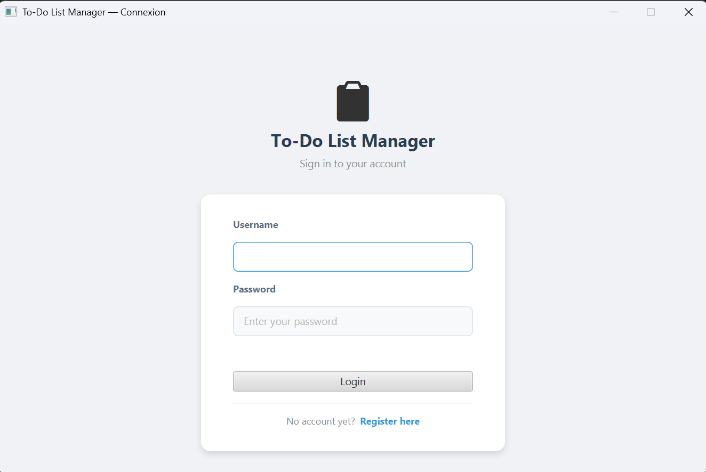
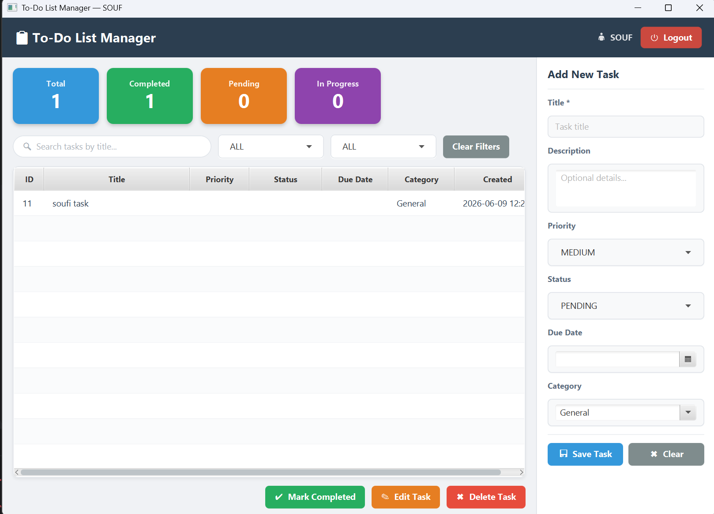
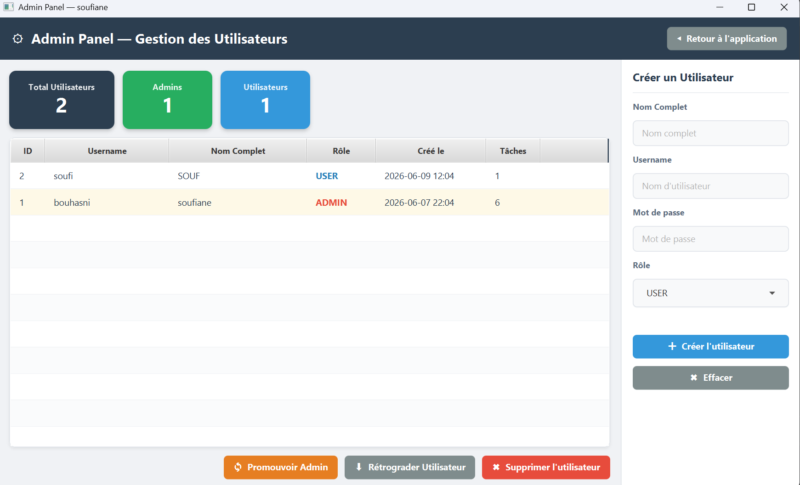

# 📋 To-Do List Manager

A full-featured desktop task management application built with **Java**, **JavaFX**, and **MySQL**.  
Supports multi-user authentication, role-based access control, and complete CRUD task management.

---

## Table of Contents

- [Overview](#overview)
- [Features](#features)
- [Screenshots](#screenshots)
- [Tech Stack](#tech-stack)
- [Project Structure](#project-structure)
- [Prerequisites](#prerequisites)
- [Installation](#installation)
- [Database Setup](#database-setup)
- [Configuration](#configuration)
- [Running the Application](#running-the-application)
- [Running Tests](#running-tests)
- [Architecture](#architecture)
- [Default Credentials](#default-credentials)
- [Author](#author)

---

## Overview

**To-Do List Manager** is a desktop application that allows multiple registered users to manage their personal tasks in a secure and organized way. Each user has a completely isolated data space. An **ADMIN** role system gives administrators the ability to manage user accounts from a dedicated admin panel.

This project was developed as a final mini-project for a Java Programming course, following the **MVC + DAO** architecture pattern with a full **JavaFX** graphical interface and a **MySQL** backend.

---

## Features

### Core Features
- Full CRUD operations on tasks (Create, Read, Update, Delete)
- Multi-user authentication (Login / Register)
- Role-based access control — **USER** and **ADMIN** roles
- Data isolation — each user sees only their own tasks
- Real-time dashboard with task statistics
- Search tasks by title (live filtering)
- Filter tasks by status and/or priority
- Mark tasks as completed
- Task due dates with overdue detection
- Task categories (General, Work, Study, Personal, Health, Finance)

### Admin Features
- View all registered users with task count
- Create new user accounts with role selection
- Delete users (cascades to their tasks automatically)
- Promote users to ADMIN / Demote admins to USER
- Admin statistics panel (total users, admins, regular users)

### Technical Features
- MVC + DAO architecture
- Singleton pattern for database connection
- JPMS module system (`module-info.java`)
- SQL injection prevention via `PreparedStatement`
- `ON DELETE CASCADE` for referential integrity
- 74 JUnit 5 automated tests (unit + integration)
- Full Javadoc documentation
- Custom CSS styling with color-coded priorities and statuses

---

## Screenshots

> Place screenshots in the `screenshots/` folder.

| Login Screen                                                                                                                                                | Main Application                                                                                                                                | Admin Panel |
|-------------------------------------------------------------------------------------------------------------------------------------------------------------|-------------------------------------------------------------------------------------------------------------------------------------------------|---|
|  |  |  |
|                                                                                                                                                             |                                                                                                                                                 |             |

---

## Tech Stack

| Technology | Version  | Purpose |
|---|----------|---|
| Java JDK | 25.0.1   | Core language |
| JavaFX | 23.0.1   | GUI framework |
| MySQL | 8.x      | Relational database |
| MySQL Connector/J | 8.3.0    | JDBC driver |
| Apache Maven | 3.x      | Build tool & dependency management |
| JUnit Jupiter | 5.10.2   | Automated testing |
| IntelliJ IDEA | 2026.1.3 | IDE |

---

## Project Structure

```
todo-app/
├── pom.xml
├── README.md
├── PROJECT_DESCRIPTION.md
├── database/
│   └── todoapp_db.sql                  # SQL schema + seed data
├── screenshots/                        # Application screenshots
└── src/
    ├── main/
    │   ├── java/
    │   │   ├── module-info.java
    │   │   └── com/todoapp/
    │   │       ├── MainApp.java
    │   │       ├── controllers/
    │   │       │   ├── TaskController.java
    │   │       │   ├── LoginController.java
    │   │       │   ├── RegisterController.java
    │   │       │   └── AdminController.java
    │   │       ├── models/
    │   │       │   ├── Task.java
    │   │       │   ├── User.java
    │   │       │   └── Session.java
    │   │       ├── dao/
    │   │       │   ├── TaskDAO.java
    │   │       │   └── UserDAO.java
    │   │       └── database/
    │   │           └── DatabaseConnection.java
    │   └── resources/com/todoapp/
    │       ├── views/
    │       │   ├── main-view.fxml
    │       │   ├── login-view.fxml
    │       │   ├── register-view.fxml
    │       │   └── admin-view.fxml
    │       └── css/
    │           └── style.css
    └── test/java/com/todoapp/
        ├── TaskModelTest.java           # 15 unit tests
        ├── UserModelTest.java           # 11 unit tests
        ├── SessionTest.java             #  7 unit tests
        ├── UserDAOTest.java             # 15 integration tests
        └── TaskDAOTest.java             # 21 integration tests
```

---

## Prerequisites

Make sure the following are installed on your machine before running the project:

- **Java JDK 21 or higher** (tested with JDK 25.0.1)  
  Download: https://adoptium.net

- **MySQL Server 8.0 or higher**  
  Download: https://dev.mysql.com/downloads/mysql/

- **Apache Maven 3.6 or higher** *(or use IntelliJ IDEA's built-in Maven)*  
  Download: https://maven.apache.org/download.cgi

- **IntelliJ IDEA** (Community or Ultimate edition)  
  Download: https://www.jetbrains.com/idea/download/

---

## Installation

### 1. Clone or download the project

```bash
git clone https://github.com/your-username/todo-app.git
cd todo-app
```

Or download the ZIP archive and extract it to your preferred location.

### 2. Open in IntelliJ IDEA

1. Launch **IntelliJ IDEA**
2. Click **File → Open**
3. Select the `todo-app` folder
4. Wait for Maven to synchronize and download all dependencies

---

## Database Setup

### Option A — MySQL Workbench (recommended)

1. Open **MySQL Workbench** and connect to your local server
2. Go to **File → Open SQL Script**
3. Select the file `database/todoapp_db.sql`
4. Click the ⚡ **Execute** button (or press `Ctrl+Shift+Enter`)

### Option B — MySQL command line

```bash
mysql -u root -p < database/todoapp_db.sql
```

### What the script creates

| Object | Description |
|---|---|
| `todoapp_db` | Database with UTF-8 encoding |
| `users` table | Stores accounts with username, password, full name, role (USER/ADMIN) |
| `tasks` table | Stores tasks linked to users via `user_id` (ON DELETE CASCADE) |
| Default admin | One admin account — see [Default Credentials](#default-credentials) |
| Sample data | Three sample tasks for the admin account |

---

## Configuration

Open the database connection file:

```
src/main/java/com/todoapp/database/DatabaseConnection.java
```

Update the constants to match your MySQL setup:

```java
private static final String HOST     = "localhost";
private static final String PORT     = "3306";
private static final String DATABASE = "todoapp_db";
private static final String USERNAME = "root";           // change if needed
private static final String PASSWORD = "your_password";  // change to yours
```

---

## Running the Application

### IntelliJ IDEA (recommended)

1. Open the project in IntelliJ IDEA
2. Make sure all Maven dependencies are downloaded (check the Maven panel)
3. Navigate to `src/main/java/com/todoapp/MainApp.java`
4. Right-click `MainApp.java` → **Run 'MainApp'**

### Maven CLI (requires Maven in system PATH)

```bash
mvn clean javafx:run
```

### Application flow

```
Launch
  └─> Login Screen
        ├─> Register (create new account)
        └─> Login (existing account)
              └─> Main Screen (task management + dashboard)
                    └─> [ADMIN only] Admin Panel (user management)
                    └─> Logout → Login Screen
```

---

## Running Tests

### IntelliJ IDEA

1. Open the **Maven** side panel
2. Expand **Lifecycle**
3. Double-click **test**

Or right-click on `src/test/java` → **Run All Tests**

### Maven CLI

```bash
mvn test
```

### Expected output

```
Tests run: 74, Failures: 0, Errors: 0, Skipped: 0
BUILD SUCCESS
```

### Test classes

| Class | Type | Tests | Coverage |
|---|---|---|---|
| `TaskModelTest` | Unit | 15 | Constructors, setters, `isOverdue()`, `isCompleted()`, enums |
| `UserModelTest` | Unit | 11 | Constructors, `isAdmin()`, Role enum |
| `SessionTest` | Unit | 7 | `setCurrentUser()`, `clear()`, `isLoggedIn()` |
| `UserDAOTest` | Integration | 15 | Register, login, role update, delete, self-delete block |
| `TaskDAOTest` | Integration | 21 | Full CRUD, data isolation, search, filter, count |

> **Note:** Integration tests require a running MySQL server with `todoapp_db` configured and accessible.

---

## Architecture

This project follows the **MVC + DAO** architecture:

```
┌───────────────────────────────────────┐
│              VIEW (FXML + CSS)        │
│  login-view  main-view  admin-view    │
└──────────────────┬────────────────────┘
                   │  user events
┌──────────────────▼────────────────────┐
│            CONTROLLER                 │
│  LoginController  TaskController      │
│  RegisterController  AdminController  │
└──────────────────┬────────────────────┘
                   │  calls
┌──────────────────▼────────────────────┐
│               DAO                     │
│       TaskDAO      UserDAO            │
│   (all SQL via PreparedStatement)     │
└──────────────────┬────────────────────┘
                   │  uses
┌──────────────────▼────────────────────┐
│            DATABASE                   │
│   DatabaseConnection (Singleton)      │
│       MySQL — todoapp_db              │
└───────────────────────────────────────┘

   SESSION (static) — cross-cutting concern
   Stores the current logged-in User object,
   accessible from any controller.
```

### Design patterns

| Pattern | Location | Purpose |
|---|---|---|
| **MVC** | Entire project | Separation of concerns |
| **DAO** | `TaskDAO`, `UserDAO` | Isolate all SQL logic from the business layer |
| **Singleton** | `DatabaseConnection` | One shared MySQL connection for the app lifetime |
| **Session** | `Session.java` | Share authenticated user across controllers |

---

## Default Credentials

The SQL script creates a default admin account:

| Field | Value |
|---|---|
| Username | `admin` |
| Password | `admin123` |
| Role | `ADMIN` |

> **Security notice:** Change the default password before using the app in any non-local environment.

---

## Author

| Field | Value |
|---|---|
| **Student** | [Your Full Name] |
| **Student ID** | [XXXXXXX] |
| **University** | [University Name] |
| **Course** | Java Programming — Final Project |
| **Academic Year** | 2025 / 2026 |
| **Supervisor** | [Professor Name] |

---

*Built with Java 25 · JavaFX 23 · MySQL 8 · Maven · JUnit 5*
